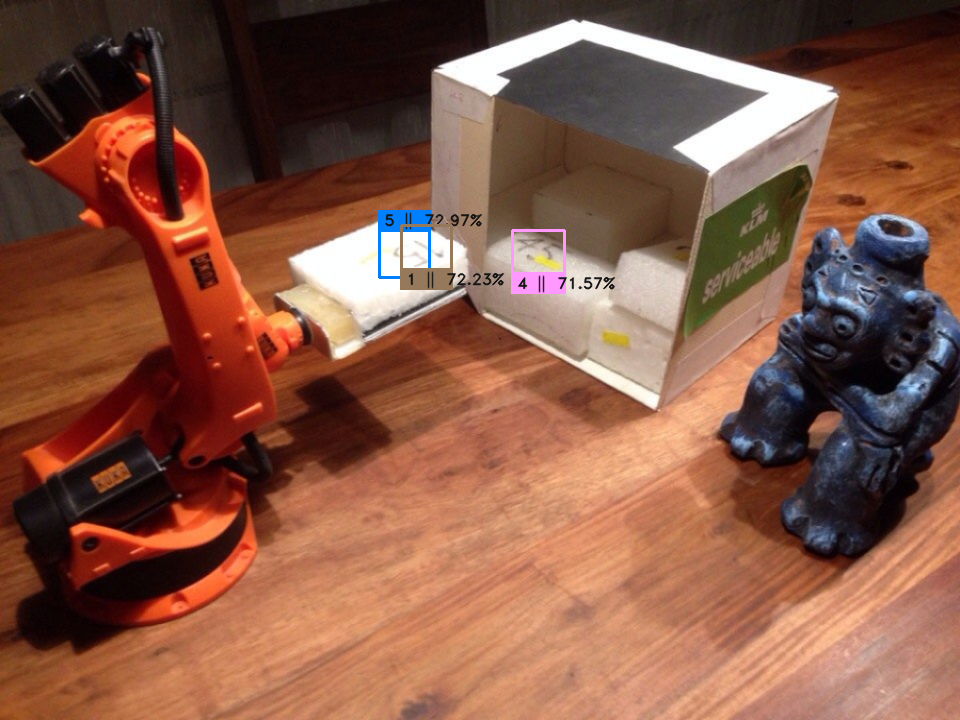

# SSD-300-Implementation-on-SVHN-dataset
### A Brief Overview:

To solve this test problem, I have used single-shot multi-object detection model (SSD -300) for reading the encoded text and identifying its location in the test image.  SSD model is based on VGG-16 and the approach defined in this [paper](https://arxiv.org/pdf/1512.02325.pdf) by Wei Liu.

Dataset used to train the model is Street View House Number dataset. ([SVHN](http://ufldl.stanford.edu/housenumbers/))
Model is trained to detect digits from 0 to 8 but not 9. (Reason: Rotation augmentation is used and 9 is detected as 6). 

Training set used = SVHN Training set +SVHN Extra Training Set

|   Model SSD-300  |   Training Set = 77% mAP   | Test Set = 68% mAP approx |
| ------------- |:-------------:| -----:|

### Some results on Test set:

### To Initiate Training:

I have used Python 3.6.5 and Tensorflow 1.12.

- Step 1    **Run train.py** file

The Program will take approx 45 min. to download SVHN dataset and start training.
The hyper-parameter values used in the program are.

  •	Batch size = 32

  •	Learning rate 

  |   Global  Step	 | Learning rate |
  | -------------    |:-------------:|
  |    0 – 2100      | 	    0.001    |
  |  2101- 15000	   |     0.0005    |
  |  15001- 20000	   |     0.0001    |
  |  20001- further  |     0.00001   |

   •	Momentum parameter for Momentum optimizer = 0.9

   •	L2 regularization factor = 0.0005

   •	Probability Threshold  = 0.5

   •	Category to be classified by neural network = 9 (digits) + 1 (background) + 4 (location coordinate)=14

- Step 2     **Run train_restore.py**

In case train.py break, run train_restore.py. Changes to be done in every restore are.

   •	Update latest metadata file name to restore program to start training.

   •	And update Step parameter value to continue training. 

- Step 3   **Run detect.py**

   •	To check results of training on Test set.

- Step 4   **Run detect_robot1.py** 

To get same result shown in Readme.md file above.
Update latest metadata file name to read text from the image robot1.png.

Check Results:

   •	My latest trained model.chkt-final files can downloaded from [google drive link](https://drive.google.com/file/d/1HaXiGvQgyS6ZIJjoNpeU4vIFhJ3Wdne4/view?usp=sharing).

   •	detect_robot1.py  can be run directly to get same results.

